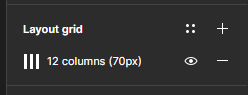

# INTRODUÇÃO

Branch dedicada para implementar designs do projeto a fim de implementar na Branch principal

# O PROJETO

O projeto principal irá utilizar React + NextJS, então utilize esta Branch para implementar o design sem utilização de frameworks.

# FIGMA 

Link para visualizar o andamento do design: 

https://www.figma.com/file/UedhkBU7DcgkhRUMshrJjW/Untitled?type=design&node-id=0%3A1&mode=design&t=9SXMxXeTDbF1TxYG-1

##### OBSERVAÇÕES:
- Por favor respeite o layout de 12 colunas definida no frame Desktop.
Caso as 12 colunas não estejam aparecendo, certifique que o Layout Grid esteja habilitado no frame. Veja exemplo abaixo:

    

- Não compartilhe o link com mais ninguém, o link está com o modo editar ativo!

- Se deseja alterar ou criar um design, copie o frame principal e faça a customização do jeito que preferir.

